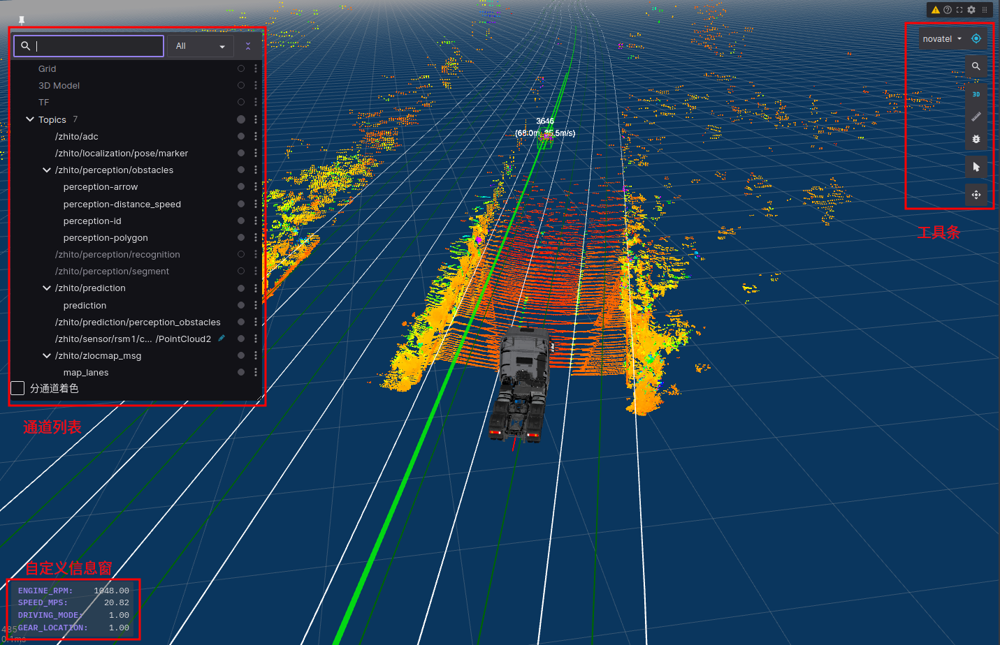

## 三维可视化

提供与Rviz一致的ros消息可视化能力，并在web技术基础上做适配和优化

### 主要功能：

* 3D场景：渲染选中的可视化通道，并提供点击、拖拽等交互
* 通道列表：通道的选择和编辑
* 自定义信息窗：提供可配置的通道字段显示（配置文件路径web/www/config/InfoFrame.json）
* 工具栏：提供检索、视角跟随等设置，从上到下依次为：
  * 相机跟随：选择要跟随的frame，点击右侧按钮切换是否跟随Frame方向
  * 文本检索：根据场景中的文本标记检索并高亮显示
  * 2D、3D场景切换
  * 距离量测（仅支持2D模式）
  * 调试信息：显示渲染相关调试信息
  * 标记点选：查看场景中渲染实体的消息详情
  * 相机信息：查看相机详情，可选择同步页面中所有3D面板的相机设置

### 依赖Topic：

无

### 支持消息类型：

#### Transform

- [`tf/tfMessage`](http://docs.ros.org/en/noetic/api/tf/html/msg/tfMessage.html)
- [`tf2_msgs/TFMessage`](http://docs.ros.org/en/noetic/api/tf2_msgs/html/msg/TFMessage.html)
- [`tf2_msgs/msg/TFMessage`](https://github.com/ros2/geometry2/blob/ros2/tf2_msgs/msg/TFMessage.msg)
- [`geometry_msgs/TransformStamped`](http://docs.ros.org/en/noetic/api/geometry_msgs/html/msg/TransformStamped.html)
- [`geometry_msgs/msg/TransformStamped`](https://github.com/ros2/common_interfaces/blob/master/geometry_msgs/msg/TransformStamped.msg)

#### Laser scan

- [`sensor_msgs/LaserScan`](http://docs.ros.org/en/noetic/api/sensor_msgs/html/msg/LaserScan.html)
- [`sensor_msgs/msg/LaserScan`](https://github.com/ros2/common_interfaces/blob/master/sensor_msgs/msg/LaserScan.msg)

#### Occupancy grid

- [`nav_msgs/OccupancyGrid`](http://docs.ros.org/en/noetic/api/nav_msgs/html/msg/OccupancyGrid.html)
- [`nav_msgs/msg/OccupancyGrid`](https://github.com/ros2/common_interfaces/blob/master/nav_msgs/msg/OccupancyGrid.msg)

#### [Marker](http://wiki.ros.org/rviz/DisplayTypes/Marker)

- [`visualization_msgs/Marker`](http://docs.ros.org/en/noetic/api/visualization_msgs/html/msg/Marker.html)
- [`visualization_msgs/msg/Marker`](https://github.com/ros2/common_interfaces/blob/master/visualization_msgs/msg/Marker.msg)
- [`visualization_msgs/MarkerArray`](http://docs.ros.org/en/noetic/api/visualization_msgs/html/msg/MarkerArray.html)
- [`visualization_msgs/msg/MarkerArray`](https://github.com/ros2/common_interfaces/blob/master/visualization_msgs/msg/MarkerArray.msg)

#### Path

- [`nav_msgs/Path`](http://docs.ros.org/en/noetic/api/nav_msgs/html/msg/Path.html)
- [`nav_msgs/msg/Path`](https://github.com/ros2/common_interfaces/blob/master/nav_msgs/msg/Path.msg)

#### Point cloud

- [`sensor_msgs/PointCloud2`](http://docs.ros.org/en/noetic/api/sensor_msgs/html/msg/PointCloud2.html)
- [`sensor_msgs/msg/PointCloud2`](https://github.com/ros2/common_interfaces/blob/master/sensor_msgs/msg/PointCloud2.msg)

#### Polygon

- [`geometry_msgs/PolygonStamped`](http://docs.ros.org/en/noetic/api/geometry_msgs/html/msg/PolygonStamped.html)
- [`geometry_msgs/msg/PolygonStamped`](https://github.com/ros2/common_interfaces/blob/master/geometry_msgs/msg/PolygonStamped.msg)

#### Pose

- [`geometry_msgs/PoseStamped`](http://docs.ros.org/en/noetic/api/geometry_msgs/html/msg/PoseStamped.html)
- [`geometry_msgs/msg/PoseStamped`](https://github.com/ros2/common_interfaces/blob/master/geometry_msgs/msg/PoseStamped.msg)

#### Velodyne scan

- [`velodyne_msgs/VelodyneScan`](http://docs.ros.org/en/noetic/api/velodyne_msgs/html/msg/VelodyneScan.html)
- [`velodyne_msgs/msg/VelodyneScan`](https://github.com/ros-drivers/velodyne/blob/ros2/velodyne_msgs/msg/VelodyneScan.msg)

#### Color

- [`std_msgs/ColorRGBA`](http://docs.ros.org/en/noetic/api/std_msgs/html/msg/ColorRGBA.html)
- [`std_msgs/msg/ColorRGBA`](https://github.com/ros2/common_interfaces/blob/master/std_msgs/msg/ColorRGBA.msg)
- 兼容以`/Color` 或 `/ColorRGBA` 结尾且包含 `r`, `g`, `b` 字段的消息类型

