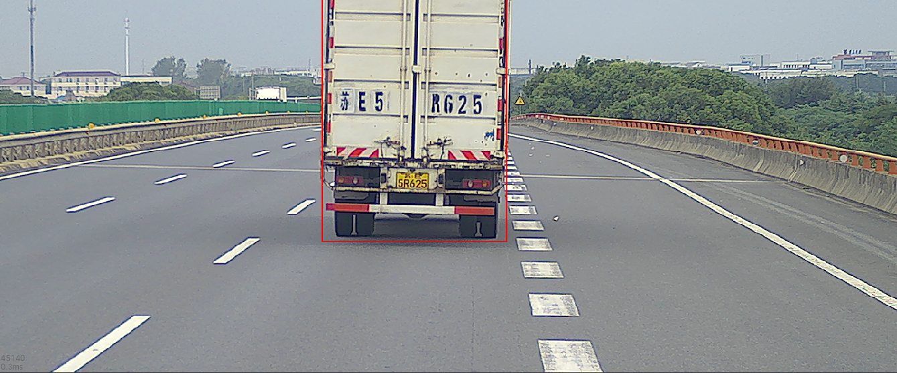

## 图像可视化

渲染多种编码格式图像，支持图像缩放、压缩、标记和校正。

### 支持消息类型：

相机属性：

* [sensor_msgs/CameraInfo](http://docs.ros.org/en/noetic/api/sensor_msgs/html/msg/CameraInfo.html) 

图像：

* [sensor_msgs/Image](https://docs.ros.org/en/noetic/api/sensor_msgs/html/msg/Image.html)
* [sensor_msgs/CompressedImage](https://docs.ros.org/en/api/sensor_msgs/html/msg/CompressedImage.html)

标记：

* [visualization_msgs/ImageMarker](http://docs.ros.org/en/noetic/api/visualization_msgs/html/msg/ImageMarker.html)
* visualization_msgs/ImageMarkerArray

### 支持编码格式：

- `8UC1`
- `8UC3`
- `16UC1`
- `32FC1`
- `bayer_bggr8`
- `bayer_gbrg8`
- `bayer_grbg8`
- `bayer_rggb8`
- `bgr8`
- `mono8`
- `mono16`
- `rgb8`
- `yuv422`

