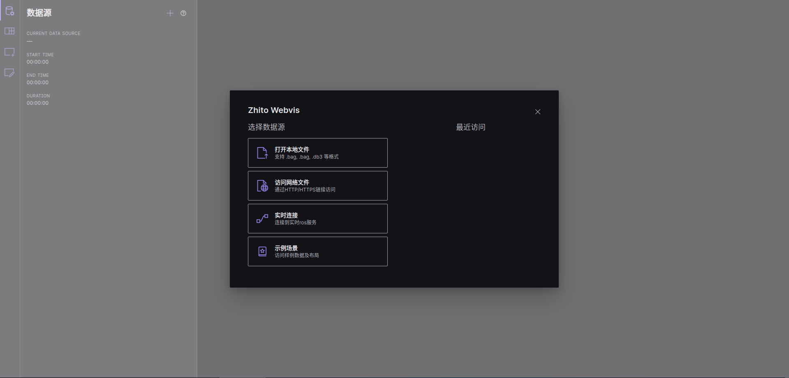
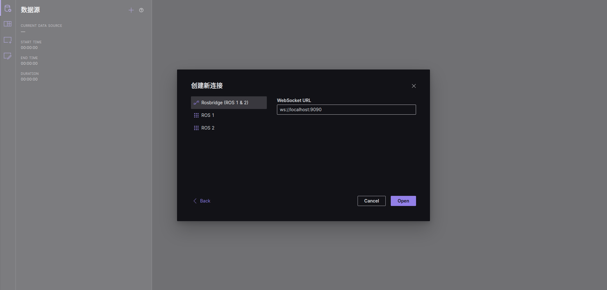
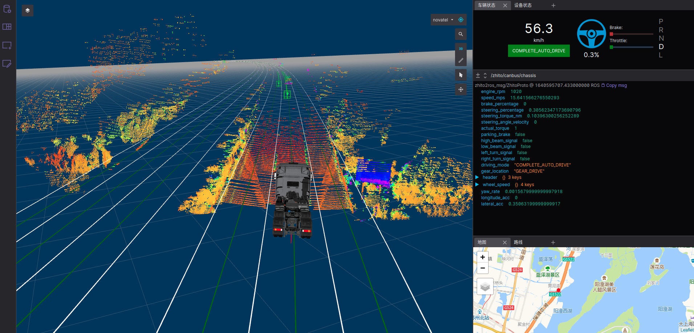

## 1.  使用条件
#### 硬件环境（推荐）

* CPU: I5 8代
* GPU: P640/GTX1050以上
* 内存：8GB

#### 软件环境
* Zhito加密环境(能够访问gitlab.zhito.com)
* Docker-CE 19.03以上版本, 且当前用户已添加至docker用户组
* Ubuntu 18.04及以上(建议)
* Chrome 93以上(Web可视化使用)
* 8090、9090端口(Web可视化使用)

## 2. X86可视化

<div id="title-2"></div>

### 2.1 本机已有cyber消息:

```bash
    # 拉取最新构建版本
    curl http://172.16.12.65/zhito2ros/release/zhito2ros-WEBVIZ_VERSION-linux-x86_tar_gz | tar -xz
    cd zhito2ros-WEBVIZ_VERSION-linux-x86
    # 启动容器
    scripts/zhito_start.sh
    # 进入容器
    scripts/zhito_into.sh
    # 启动bridge及web服务
    ./scripts/run-all.sh
```
访问 http://localhost:8090

### 2.2 回播record(可选)
完成上述步骤后, docker内执行:
```bash
    # 引入cyber环境
    source ./scripts/cyber-setup.bash
    # 播放cyber record
    cyber_record play -f xxxx.record -l
```

## 3 V3NA订阅可视化

订阅V3NA端fastdds消息并转发至cyber, 与本地可视化一致
### 3.1 v3na端

v3na端配置参考: https://confluence.zhito.com:8090/pages/viewpage.action?pageId=40024444

### 3.2 pc端

#### a. v3na->cyber数据订阅
* 初次使用需加载镜像(上车部署请提前下载)
```bash
  curl http://172.16.12.65/v3na_docker_tar_gz | tar -xz
  docker load -i v3na_docker_tar
```
下载工具并订阅消息

```bash
  curl http://172.16.12.65/tool/v3na-ros2-tools-v2.4.2.2-1103_tar_gz | tar -xz
  cd v3na-ros2-tools-v2.4.2.2-1103
  # 启动镜像
  ./scripts/zhito_start.sh

  # 进入镜像
  ./scripts/zhito_into.sh

  # 指定ROS_DOMAIN_ID(与v3na端DDS_DOMAIN_ID一致)
  export ROS_DOMAIN_ID=88
  # 启动订阅
  ros2 bag sub --cyber
```

v3na-ros-tools
<a href="#/ros-data" title="使用说明">使用说明</a>,
<a href="#/ros-update" title="更新日志">更新日志</a>
#### b. 启动可视化
与[2.1 X86可视化](#title-2)一致


## 4. 可视化使用

​	Chrome/Edge访问8090端口即可进入web可视化页面，如 http://localhost:8090




​	选择实时连接，将localhost替换为PC机IP(9090端口不用修改)，点击Open



​	点击侧边栏第二个按钮"布局"点击+号添加布局，即可创建默认布局


